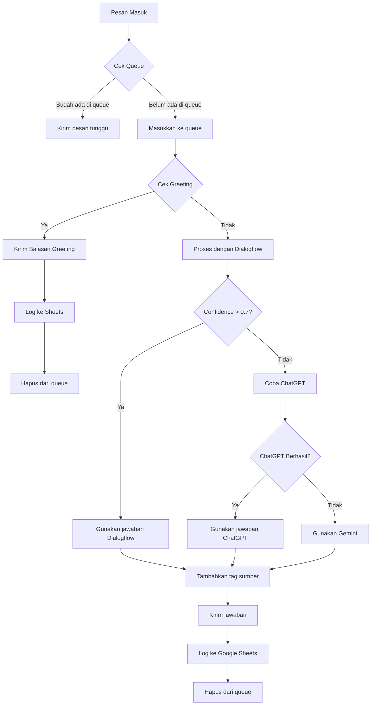

# Alur Kerja Sistem WhatsApp AI Chatbot

## 1. Inisialisasi Sistem
- Sistem dimulai dari `index.js`
- Menginisialisasi WhatsApp client dengan konfigurasi keamanan
- Memuat semua layanan (Greetings, Dialogflow, ChatGPT, Gemini)
- Mempersiapkan koneksi ke Google Sheets untuk logging

## 2. Proses Autentikasi WhatsApp
1. Sistem menghasilkan QR code
2. User melakukan scan QR code dengan WhatsApp
3. Setelah terautentikasi, sistem siap menerima pesan

## 3. Alur Pemrosesan Pesan
Ketika ada pesan masuk dari pengguna:



## 4. Detail Proses Per Layanan

### a. Greetings Handler
- Mendeteksi berbagai jenis salam:
  * Salam Islam (Assalamu'alaikum)
  * Sapaan umum (Halo, Hi, Hey)
  * Sapaan waktu (Selamat pagi/siang/sore/malam)
- Memberikan respons yang sesuai dengan:
  * Waktu saat ini
  * Jenis sapaan
  * Emoji yang relevan
- Response langsung tanpa perlu proses AI

### b. Dialogflow
- Menerima pesan non-greeting
- Menganalisis intent (maksud) pesan
- Jika confidence > 0.7, memberikan respons terstruktur
- Response ditandai dengan "_jawaban digenerate oleh sistem_"

### c. ChatGPT
- Digunakan jika Dialogflow tidak yakin dengan intent
- Menggunakan model GPT untuk generasi teks
- Memiliki sistem retry jika terjadi error
- Response ditandai dengan "_jawaban digenerate oleh ChatGPT_"

### d. Gemini
- Berfungsi sebagai fallback jika ChatGPT gagal
- Menggunakan Google's Generative AI
- Memiliki sistem retry sendiri
- Response ditandai dengan "_jawaban digenerate oleh Gemini_"

## 5. Contoh Respons Greeting

### Salam Islam
- Input: "Assalamu'alaikum"
- Response: "Wa'alaikumsalam Warahmatullahi Wabarakatuh 🙏"

### Sapaan Waktu
- Input: "Selamat pagi"
- Response: "Selamat pagi juga! 🌅 Semoga hari Anda menyenangkan!"
- (Emoji menyesuaikan waktu: 🌅 pagi, ☀️ siang, 🌤️ sore, 🌙 malam)

### Sapaan Umum
- Input: "Halo"
- Response: "Halo! Selamat [waktu]! [emoji] Ada yang bisa saya bantu?"

## 6. Sistem Logging
Setiap percakapan dicatat ke Google Sheets dengan informasi:
- Timestamp
- ID Pengirim
- Pesan User
- Respons Bot
- Sumber Respons (greeting/dialogflow/chatgpt/gemini)
- Bahasa yang Digunakan

## 7. Penanganan Error
- Setiap layanan memiliki error handling sendiri
- Error dikategorikan berdasarkan sumbernya
- User mendapat pesan error yang ramah
- Error dilog dengan detail untuk debugging

## 8. Sistem Antrian (Queue)
- Mencegah pemrosesan ganda untuk pengirim yang sama
- Mengirim pesan "mohon tunggu" jika masih dalam proses
- Menggunakan Map untuk tracking status pemrosesan
- Membersihkan queue setelah selesai/error

## 9. Fitur Tambahan
- Indikator mengetik saat memproses
- Retry otomatis untuk API calls
- Fallback bertingkat antar AI
- Logging komprehensif untuk monitoring

## 10. Konfigurasi yang Dibutuhkan (.env)
```
DIALOGFLOW_PROJECT_ID=your_project_id
GOOGLE_APPLICATION_CREDENTIALS=path_to_credentials.json
OPENAI_API_KEY=your_openai_key
GEMINI_API_KEY=your_gemini_key
GOOGLE_SHEETS_ID=your_sheets_id
DIALOGFLOW_LANGUAGE_CODE=id
